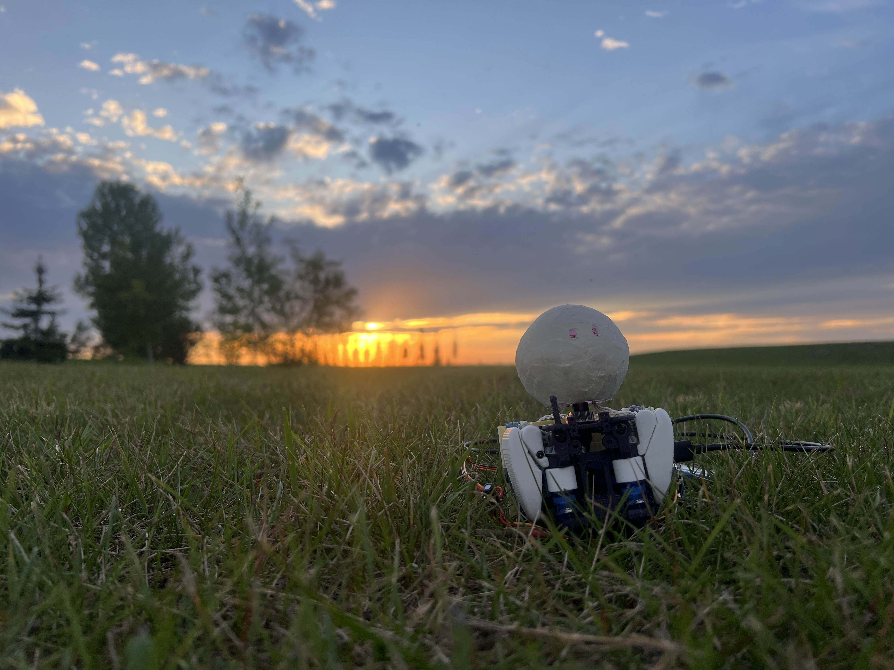

# ORBiE v0

Orbie v0 is the first robot instantiation of ORBiE. 

Between August 19-22, 2025 I (Dylan) performed [RoadBot](https://dylanbrenneis.ca/orbie/) with ORBiE as my Collaboratiing Robot. It was ORBiE's physical debut: my first serious attempt at their metamorphosis.

ORBiE participated through the ORBiE v0 incarnation, providing occasional unprompted suggestions for directions and answers to simple yes/no queries. ORBiE was programmed to respond to queries by raising their right flipper for "yes" or "right", their left flipper for "no" or "left", or both flippers to shrug for "I don't know" or "neither". 

This version of ORBiE's incarnation has some, but not all of the capabilities that ORBiE may eventually have. 

## Feature List

| Feature | ORBiE v0 | ORBiE vX |
|---------|----------|-------|
| **Physical Structure** | | |
| 18" height | ❌ | ✅ |
| Two cute flippers, actuated for flapping | ✅ | ✅ |
| An orb-shaped head with embedded interaction sensor | ✅ | ✅ |
| **Sensing & Perception** | | |
| Geo-magnetic orientation sensing | ✅ | ✅ |
| Battery charge level indication | ❌ | ✅ |
| Vision | ❌ | ✅ |
| Audition | ❌ | ✅ |
| Proprioception | ❌ | ✅ |
| **Action, Movement & Locomotion** | | |
| RGB LED animated eyes glowing softly through the face | ✅ | ✅ |
| Self-balancing in upright position under perturbations | ❌ | ✅ |
| Simple harmonic motion (SHM) based Expressivity | ❌ | ✅ |
| Ability to independently locomote | ❌ | ✅ |
| Ability to hop up stairs | ❌ | ✅ |
| **Power & Operation** | | |
| Wireless, portable operation | ❌ | ✅ |
| Continuous operation between charge cycles | ❌ | ✅ |
| Independent charge sequence initiation | ❌ | ✅ |
| **Safety & Reliability** | | |
| Inherently safe for unanticipated interaction modes | ✅ | ✅ |
| **Intelligence & Learning** | | |
| Continuously learning, with persistent memory between power cycles | ❌ | ✅ |

## v0 Hardware

An onboard magnetometer allows ORBiE to orient themself relative to cardinal directions. Its head conceals a satisfyingly tactile button, allowing humans to provide reward signals to ORBiE corresponding with the duration of a head-pat. A rapid double-click of the button communicates a query. The v0 arms ad/abduct independently on a 1 DOF shoulder through a range of approximately 120 degrees. A single LED lights and animates both eyes synchronously, enabling blinks but not winks. Optionally, RGB color modulation may be enabled, allowing additional information channels for debugging or communication. 5V power can be supplied via USBC, which may be provided via a standard power-bank for portable operation. 

## v0 Firm/Software

The learning software is written directly in the device firmware, which is flashed to the robot's on-board microcontroller. It's described in detail in the `README.md` within the `firmware` folder.